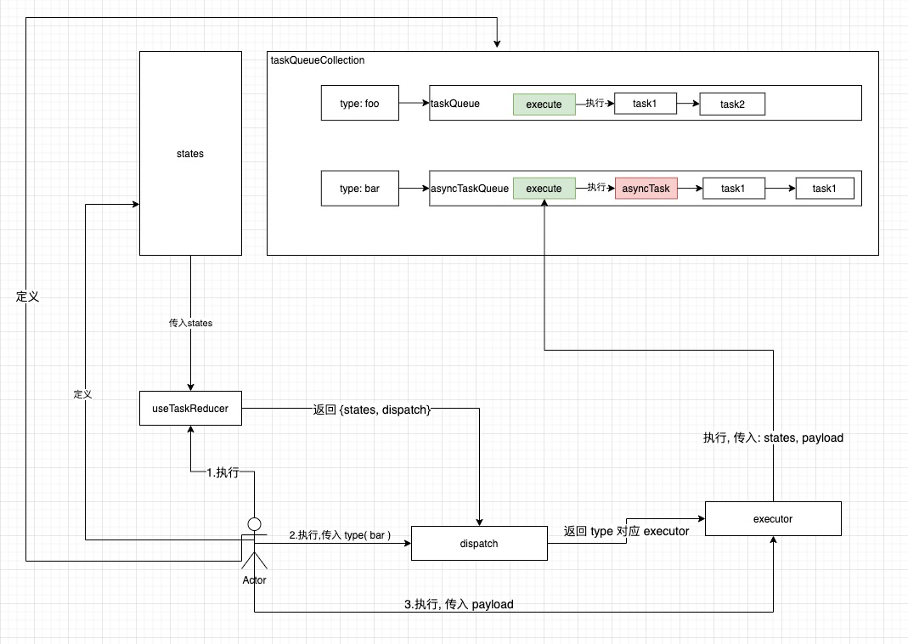

## vue 3 task reducer

- 任务归纳系统
- 从视图中抽离逻辑
- 事件驱动
- typescript 支持

## 抽离逻辑

从组件中抽离逻辑, 让组件只想要关注视图和数据的传递

## 示例

[普通开发模式和 taskReducer 模式对比](https://github.com/liaohui5/vue3-dispatcher-demo)

[实际项目应用](https://github.com/lh5sa/vue3-client)

## TODO

基本逻辑写完了没有问题, 但是 ts 类型约束还有点问题, 导致 ts 爆红,

而且代码提示稍微有点问题, 但是主体逻辑没有问题可以自行
